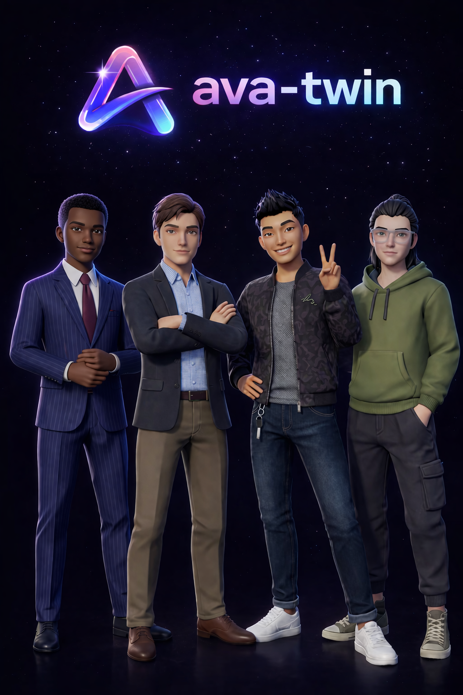

# Ava-Twin Unity SDK

<p align="center">
  
</p>

Customizable stylized 3D avatars for Unity games. Players pick their look in an embedded customizer, and you load the result with a single async call. Works with any Humanoid animation system.

## Supported Platforms

| Platform | Status |
|----------|--------|
|  | Fully tested in production |
|  | Windows, macOS, Linux |
|  | Native in-app customizer |
|  | Native in-app customizer |
|  | Desktop standalone |
|  | Desktop standalone |
|  | Desktop standalone |

## Render Pipelines

| Pipeline | Status |
|----------|--------|
|  | Auto-detected |
|  | Auto-detected |

## Quick Start

### Open the customizer and get an avatar

```csharp
using AvaTwin;

var result = await SDK.OpenCustomizerAsync();
if (result != null)
{
    // result.Root       — the instantiated avatar GameObject
    // result.AvatarId   — opaque ID for persistence and multiplayer sync
    // result.SkinToneHex — applied skin tone (e.g. "#FFDFC4")
    
    result.Root.transform.SetParent(playerTransform);
    
    // Assign the humanoid avatar to your Animator for Mecanim animations
    var humanoid = result.GetUnityHumanoidAvatar();
    if (humanoid != null)
    {
        animator.avatar = humanoid;
        animator.Rebind();
    }
}
```

### Load a saved avatar by ID

```csharp
var result = await SDK.LoadAvatar(savedAvatarId, skinToneHex);
if (result != null)
{
    result.Root.transform.SetParent(playerTransform);
}
```

### Multiplayer — load remote player avatars

```csharp
// Each player stores their AvatarId (short alphanumeric string).
// Remote players call LoadAvatar with the ID received over the network.
var result = await SDK.LoadAvatar(remoteAvatarId, remoteSkinTone);
```

See the full [Multiplayer Guide](https://ava-twin.me/docs/multiplayer) for Photon, Mirror, and Netcode examples.

## Installation

### Via Git URL (recommended)

In Unity: **Window → Package Manager → + → Add package from git URL**

```
https://github.com/waqaszs/ava-twin-unity-sdk.git#v1.0.0
```

Dependencies (glTFast, Newtonsoft JSON) are resolved automatically.

### Manual

Download the latest release from the [Releases](https://github.com/waqaszs/ava-twin-unity-sdk/releases) page and import into your project.

## Setup

1. **Get credentials** at [console.ava-twin.me](https://console.ava-twin.me) — create an account, add an app, copy your App ID and API Key.
2. The **Ava-Twin Setup Window** opens automatically on first import. Enter your credentials and click **Test Connection** to verify.
3. If the window doesn't open automatically, go to **Window → Ava-Twin → Setup** in the Unity menu bar.
4. Click **Import Demo Scene** in the Setup window to add the demo to your project.

## Demo Scene

Import the demo scene from the Setup window, or via **Package Manager → Ava-Twin SDK → Samples → Import**. It includes a Customize button, avatar spawning, and third-person movement.

## API Reference

### `SDK.OpenCustomizerAsync()`

Opens the avatar customizer UI. Returns when the player saves their avatar.

```csharp
public static async Task<AvatarResult> OpenCustomizerAsync()
```

- **WebGL:** Opens an embedded iframe customizer
- **Editor:** Loads a random avatar for quick testing
- **Mobile:** Opens the native in-app customizer (coming soon)

Returns `null` if the customizer is closed without saving.

### `SDK.LoadAvatar(avatarId, skinToneHex)`

Loads an avatar by its ID. Concurrent-safe for multiplayer.

```csharp
public static async Task<AvatarResult> LoadAvatar(string avatarId, string skinToneHex = null)
```

- `avatarId` — the opaque ID from `AvatarResult.AvatarId` or from your player database
- `skinToneHex` — optional hex color (e.g. `"#FFDFC4"`). If null, uses the default for the avatar's head variant.

### `AvatarResult`

| Property | Type | Description |
|----------|------|-------------|
| `Root` | `GameObject` | The instantiated avatar root |
| `AvatarId` | `string` | Opaque ID for persistence and network sync |
| `SkinToneHex` | `string` | Applied skin tone hex color |
| `GetUnityHumanoidAvatar()` | `Avatar` | Unity Humanoid Avatar for Mecanim |

## Documentation

- [Unity SDK Reference](https://ava-twin.me/docs/unity-sdk)
- [Multiplayer Guide](https://ava-twin.me/docs/multiplayer)
- [Getting Started](https://ava-twin.me/docs/getting-started)
- [REST API](https://ava-twin.me/docs/api)
- [Pricing & Plans](https://ava-twin.me/docs/pricing)

## Requirements

- Unity 2021.3 LTS or later
- glTFast 5.2.0+ (auto-installed)
- Newtonsoft JSON 3.2.1+ (auto-installed)

## License

See [LICENSE](LICENSE.md) for details. Animations by Kevin Iglesias — see [THIRD_PARTY_NOTICES.md](THIRD_PARTY_NOTICES.md).
